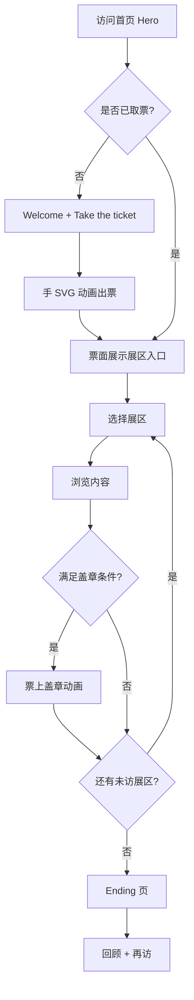

# Creative Exhibition Homepage PRD

## 文档元信息

| 字段 | 内容 |
|---|---|
| 文档标题 | Creative Exhibition Homepage PRD |
| PRD ID | IN-HOME-001 |
| 类型 | C 创新型 |
| 版本 | V0.1 |
| 更新日期 | 2026-07-13 |
| 负责人 | 站点所有者 |
| 状态 | 起草中 |
| 优先级 | P0 |
| 排期 | MVP 分阶段交付（逐页） |

### 关联文档

| 文档 | 路径 | 用途 |
|---|---|---|
| 产品上下文 | `docs/00_product_context/product-context.md` | 术语、约束、展区定义 |
| 技术架构 | `docs/02_architecture/ARCHITECTURE.md` | 技术选型与模块划分 |
| 目录结构 | `docs/02_architecture/DIRECTORY_STRUCTURE.md` | 工程组织 |

### 需求概述

为个人品牌构建一个**展览式多页面主页**：访客从 Hero 开屏进入，通过「Take the ticket」取票获得导航，依次参观 About、AIGC 艺术、Vibe Coding、文章等展区，并在票上收集盖章，最后在 Ending 页收尾。整体采用可爱手绘美学，结合 Canvas 2D / Three.js 互动，部署于 GitHub + Vercel 并绑定自定义域名。MVP 按页迭代实现，视觉与控件细节由后续设计稿驱动。

---

## 1. 背景与目标

### 1.1 背景

传统个人主页多为模板化 Portfolio，缺乏叙事与记忆点。本产品以「参观创意世界展览」为隐喻，将自我介绍、AIGC 作品、Vibe 项目与文章统一进一条可收集、可回味的动线，强化个人审美与互动能力展示。部署侧需低运维（GitHub + Vercel + 自有域名）。

### 1.2 目标

| # | 目标 | 说明 |
|---|---|---|
| 1 | 建立独特品牌记忆 | 访客 30 秒内理解「创意展览」主题并愿意取票进入 |
| 2 | 完整展示四类内容 | About、AIGC、Vibe、文章均可达且内容清晰可读 |
| 3 | 可完成的展览动线 | 用户可从 Hero 走到 Ending，并在票上看到进度/盖章 |
| 4 | 稳定上线 | 主域名可访问，Lighthouse 性能与可访问性达可接受基线 |
| 5 | 可持续迭代 | 逐页开发；新增文章/作品不需改核心动线代码 |

---

## 2. 产品范围与用户路径

| # | 模式/路径 | 交互入口 | 用户行为 | 系统行为 | 输出结果 |
|---|---|---|---|---|---|
| 1 | 首次参观 | 域名 `/` | 阅读 Welcome，点击 Take the ticket | 播放取票动画（手 SVG + 出票），展示票导航 | 进入展览；票可用；进度初始化 |
| 2 | 展区参观 | 票上展区入口 | 进入 About / Art / Vibe / Articles 等 | 加载展区页；记录「已访问」；离开时触发盖章 | 展区内容展示；票上新增章 |
| 3 | 深读文章 | 文章列表 → 详情 | 阅读 MDX 文章 | SSG/SSR 渲染正文；装饰层手绘框架 | 可读文章页；可分享 URL |
| 4 | 结束参观 | Ending 入口或动线末尾 | 查看收尾文案/回顾 | 展示已收集章；提供再访或外链 | 展览闭环 |
| 5 | 再访 | 书签 / 直链展区 | 跳过或缩短 Hero | 读取 localStorage 进度；票直接可用 | 快速进入曾访问展区 |

### 2.1 In Scope

- Hero 开屏与 Take the ticket 交互
- 票（导航）与各展区路由
- 盖章/参观进度（本地持久化）
- 扉页 About（含可选自媒体链接）
- AIGC 艺术画廊展区
- Vibe Coding 作品与外链展区
- 文章列表 + 文章详情页
- Ending 收尾页
- GitHub + Vercel 部署与自定义域名
- 手绘风视觉体系（字体、按钮、纸质感）
- Canvas 2D / Three.js 按页集成

### 2.2 Out of Scope（非 MVP）

- 用户登录、评论、后台 CMS
- 服务端保存参观进度（跨设备同步）
- 多语言 i18n
- 复杂 3D 全站漫游
- 音频导览 / 全屏 VR

---

## 3. 核心规则

| # | 规则项 | MVP 约定 | 备注 |
|---|---|---|---|
| 1 | 默认语言 | 中文为主，英文 UI 文案可混排 | 待确认最终语言策略 |
| 2 | 导航形态 | 票为一级导航；无传统顶栏 MVP | 可保留极简「回票」入口 |
| 3 | 盖章触发 | 进入展区并停留 ≥N 秒或滚动至底部（按页配置） | N 默认 5s，可调整 |
| 4 | 进度存储 | `localStorage` | 清缓存则进度丢失 |
| 5 | 文章格式 | MDX + frontmatter | 标题、日期、标签、封面 |
| 6 | 外链 | Vibe / 自媒体新开 tab | `rel="noopener noreferrer"` |
| 7 | 动画降级 | `prefers-reduced-motion: reduce` 时跳过非必要动画 | 必须 |
| 8 | WebGL | 仅 Hero 或指定页启用；失败时静态图降级 | 按页决策 |
| 9 | 不支持 | IE；无 JS 环境仅展示静态 fallback 文案 | 可选增强 |

---

## 4. 领域规则

### 4.1 展览编排（Storyline）

| # | 规则 | 说明 |
|---|---|---|
| 1 | 动线顺序 | Hero → 票 →（About → Art → Vibe → Articles）→ Ending；顺序可微调但需有叙事逻辑 |
| 2 | 章与展区映射 | 每个展区最多 1 枚章；章样式与展区主题一致 |
| 3 | 票的状态 | `pristine`（未取票）→ `active`（已取票）→ `completed`（全部章集齐，可选特效） |

### 4.2 内容组织

| # | 规则 | 说明 |
|---|---|---|
| 1 | AIGC 作品 | 固定画框内循环展示；图 + 标题 + 可选提示词、创作思路、标签、年份、工具与系列；点击进入沉浸查看 |
| 2 | Vibe 作品 | 卡片：名称、简述、技术标签、外链 |
| 3 | 文章 | 列表按日期倒序；详情支持代码块与图片 |
| 4 | 自媒体 | 扉页或文章区展示图标链；具体平台列表待补充 |

### 4.3 视觉一致性

| # | 规则 | 说明 |
|---|---|---|
| 1 | 设计令牌 | 颜色、字体、边框粗糙度、阴影由 `design-tokens` 统一 | 待设计稿 |
| 2 | 控件绘制 | 按钮/边框/手/票等 SVG 或 Canvas 路径；**具体绘制规范由用户逐页提供** |
| 3 | 纸质感 | 背景纹理、邮票/撕纸边可选统一素材 |

---

## 5. 用户交互流程

### 5.1 首次完整参观



| 步骤 | 用户 | 系统 |
|---|---|---|
| 1 | 打开站点 | 展示 Hero「Welcome to my creative world」 |
| 2 | 点击 Take the ticket | 播放手递票动画；票展开 |
| 3 | 点击票上展区 | 路由跳转；展区手绘框架加载 |
| 4 | 阅读/滚动 | 计时或滚动检测 |
| 5 | 离开或完成 | 盖章反馈；更新 localStorage |
| 6 | 进入 Ending | 展示收尾与已收集章 |

### 5.2 再访 / 深链

| 步骤 | 用户 | 系统 |
|---|---|---|
| 1 | 直接打开 `/articles/xxx` | 文章可读；票进度仍从 localStorage 恢复 |
| 2 | 点击「回票」 | 展示当前票与章状态 |

---

## 6. 原型示意

> 低保真结构，不代表最终视觉。精细稿由用户提供。

### 6.1 Hero 开屏

```
┌─────────────────────────────────────┐
│  [纸纹/fullscreen 背景]              │
│                                     │
│     Welcome to my creative world    │  ← 手写字体
│                                     │
│     ┌──────────────────┐            │
│     │ Take the ticket    │            │  ← 歪扭手绘按钮
│     └──────────────────┘            │
│                                     │
│              (手 SVG 初始隐藏)        │
└─────────────────────────────────────┘
```

### 6.2 取票后（票 = 导航）

```
┌─────────────────────────────────────┐
│   ╭── 票根纹理 ─────────────────╮   │
│   │  [About] [Art] [Vibe] [Blog] │   │
│   │   ○      ○     ○      ○      │   │  ← 章槽位
│   ╰──────────────────────────────╯   │
└─────────────────────────────────────┘
```

### 6.3 典型展区

```
┌─────────────────────────────────────┐
│  ← 回票    展区标题（手绘下划线）      │
├─────────────────────────────────────┤
│  [内容区：画廊 / 卡片 / 文章列表]    │
├─────────────────────────────────────┤
│  下一展区 → / Ending                │
└─────────────────────────────────────┘
```

### 6.4 Ending

```
┌─────────────────────────────────────┐
│  感谢参观 / Thanks for visiting      │
│  [已集齐的章展示]                    │
│  [回到 Hero / 某个外链]              │
└─────────────────────────────────────┘
```

---

## 7. 错误与异常

| 场景 | 用户可见提示 | 系统行为 | MVP |
|---|---|---|---|
| WebGL 不可用 | 无（静默） | 使用静态背景图 | 是 |
| 图片加载失败 | 占位 sketch 框 | `onError` 替换占位 | 是 |
| 文章 404 | 手绘风「迷路了」页 | 引导回票 | 是 |
| localStorage 不可用 | 无提示 | 进度不持久；当次有效 | 是 |
| 字体加载慢 | 系统手写 fallback | FOUT 可接受 | 是 |
| 外链失效 | — | 用户自行发现；后期可加检测 | 否 |

---

## 8. 结果存放与展示

| 项 | 说明 |
|---|---|
| 存储位置 | 文章元数据：仓库内 MDX；AIGC 作品：`src/components/gallery/artworks.ts`；参观进度：浏览器 localStorage |
| 展示入口 | 各展区路由 + 票面章状态 |
| 组织方式 | `content/articles/*.mdx`；AIGC 图片可使用 `public/assets/AIGCArtwork/` 本地文件或 HTTPS 图床；详细维护步骤见根目录 README |
| 跨端同步 | MVP 不支持；RoadMap 可考虑账号或导出票根图片 |

---

## 9. 质量标准与验收

### 9.1 性能与耗时验收

| # | 项目 | 条件 | 要求 | 口径 |
|---|---|---|---|---|
| 1 | Hero 首屏 LCP | 4G 模拟 | ≤ 2.5s | P75 |
| 2 | 取票动画 | 点击后 | 首帧反馈 < 100ms | 必须 |
| 3 | 路由切换 | 展区间 | 可感知过渡 < 500ms | P90 |
| 4 | Three.js 场景 | 中端手机 | ≥ 30fps 或自动降级 | 必须 |
| 5 | 文章页 CLS | 静态内容 | < 0.1 | 必须 |

### 9.2 质量验收

| # | 维度 | 验收方法 | 通过标准 |
|---|---|---|---|
| 1 | 展览动线 | 走查 | Hero→票→至少 4 展区→Ending 无阻断 |
| 2 | 盖章逻辑 | 功能测试 | 每展区最多一章；刷新后保留 |
| 3 | 手绘一致性 | 视觉评审 | 字体/按钮/边框符合设计稿 |
| 4 | 响应式 | 320–1920px | 内容可读；票可操作 |
| 5 | a11y | 键盘 + 屏阅 | 核心链可达；图片有 alt |
| 6 | 部署 | 生产域名 | HTTPS；Vercel 构建成功 |

---

## 10. 埋点

| 事件名 | 触发时机 | 关键属性 | MVP |
|---|---|---|---|
| `exhibition_view_hero` | Hero 曝光 | `referrer` | 否 |
| `exhibition_take_ticket` | 点击取票 | — | 否 |
| `exhibition_enter_zone` | 进入展区 | `zone_id` | 否 |
| `exhibition_stamp_earned` | 获得章 | `zone_id` | 否 |
| `exhibition_complete` | 进入 Ending 且章满 | `stamp_count` | 否 |
| `exhibition_outbound_click` | 点击 Vibe/自媒体外链 | `url` | 否 |

> MVP 可不接入分析；架构预留 `lib/analytics` 接口。

---

## 11. 用户故事

| ID | 故事 | 验收要点 |
|---|---|---|
| US-001 | 作为访客，我想在开屏看到欢迎语并取票，以便开始参观 | Take the ticket 有动画反馈；票出现 |
| US-002 | 作为访客，我想通过票选择展区，以便按兴趣浏览 | 票上入口可点击且路由正确 |
| US-003 | 作为访客，我想完成展区后获得盖章，以便有收集感 | 章显示在票上且持久化 |
| US-004 | 作为访客，我想在 About 了解作者并找到自媒体 | 扉页内容与链接可用 |
| US-005 | 作为访客，我想浏览 AIGC 画廊 | 作品图与信息展示完整 |
| US-006 | 作为访客，我想查看 Vibe 项目并跳转 | 外链正确新开 |
| US-007 | 作为读者，我想阅读文章 | 列表与详情可读、可分享 URL |
| US-008 | 作为访客，我想在 Ending 完成展览 | 收尾页可回到 Hero 或票 |

---

## 12. 后续迭代 RoadMap

| 阶段 | 内容 | 依赖 |
|---|---|---|
| V1.1 | 埋点与分析；SEO 增强 | MVP 上线 |
| V1.2 | 票根导出分享图（Canvas 合成） | 盖章系统稳定 |
| V1.3 | 音效与 ambient BGM（可关） | 资源与版权 |
| V1.4 | 更多 Three.js 展厅（如 Art 3D 墙） | 性能预算 |
| V2 | Headless CMS / 管理后台 | 内容量增大 |
| V2 | 跨设备进度同步 | 账号体系 |

---

## 13. MVP 范围

### 13.1 MVP 必须

- Hero + Take the ticket + 手 SVG 出票（视觉细节跟设计稿）
- 票导航（含章槽位与已章展示）
- 5 个内容展区 + Ending（About、Art、Vibe、Articles、Ending）
- 文章 MDX 至少 1 篇样例
- 参观进度 localStorage
- 响应式布局 + reduced-motion
- Vercel 部署 + 自定义域名文档

### 13.2 MVP 可降级 / 简化

- Three.js 先仅用静态/Canvas 2D 替代
- 盖章条件统一为「进入即盖」而非滚动检测
- 转场动画简化为 fade/slide
- 埋点暂不接入

### 13.3 MVP 明确不做

- 登录、评论、搜索
- 全站 3D 漫游
- 多语言
- 服务端 API

---

## 待决问题

| # | 问题 | 影响章节 | 建议决策人 |
|---|---|---|---|
| 1 | 票是独立路由还是 Hero 内嵌组件？ | §5、架构 | 开发者 + 设计 |
| 2 | 自媒体链接放扉页还是单独区域？ | §4.2 | 站点所有者 |
| 3 | 主文案中文/英文比例？ | §3 | 站点所有者 |
| 4 | AIGC 作品数量与是否需灯箱？ | §4.2、§6 | 站点所有者 |
| 5 | 自定义手写字体文件是否已就绪？ | §4.3 | 设计 |
| 6 | Three.js 用于哪几页？ | §3、架构 | 开发者 |
| 7 | 盖章是否允许「跳过展区」仍进 Ending？ | §4.1 | 产品 |
| 8 | 域名与 GitHub 仓库命名？ | 部署 | 站点所有者 |
