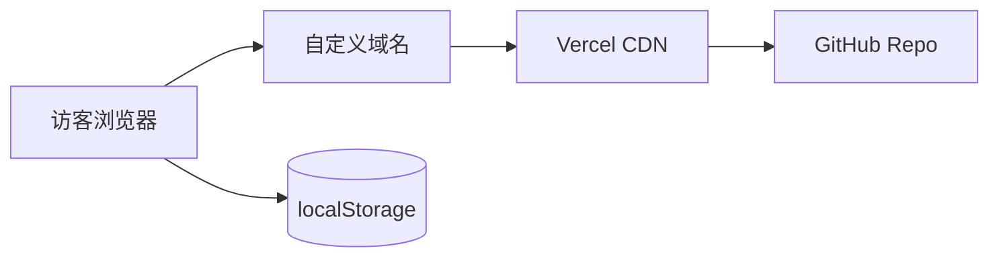
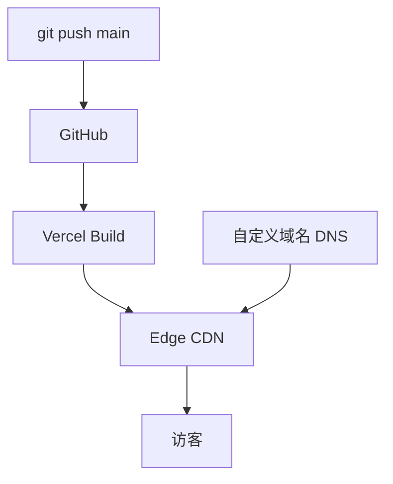

# Technical Architecture — Creative Exhibition Homepage

> 版本 V0.1 · 2026-07-13 · 与 PRD `IN-HOME-001` 对齐

---

## 1. 架构目标

| 目标 | 策略 |
|---|---|
| Vercel 友好 | Next.js App Router，静态生成为主 |
| 展览式体验 | 客户端动线状态 + 页面转场；Canvas/WebGL 作装饰与互动层 |
| 逐页迭代 | 展区模块化；共享设计令牌与票/章系统 |
| 内容可维护 | MDX 文章 + JSON 作品元数据，免后端 |
| 性能可控 | 按路由代码分割；Three.js 动态 import |

---

## 2. 技术选型

| 层级 | 选型 | 理由 |
|---|---|---|
| 框架 | **Next.js 15**（App Router）+ **TypeScript** | SSG 文章、Vercel 零配置、路由清晰 |
| 样式 | **CSS Modules** + **CSS Variables**（设计令牌） | 与手绘 SVG 并存；避免 heavy UI 库 |
| 动画 | **GSAP** 或 **Motion**（待首屏实现时二选一） | 取票、盖章时间轴 |
| 2D 手绘 | **Canvas 2D** + **SVG**（内联 React 组件） | 手、票、歪扭边框 |
| 3D（可选） | **Three.js** + **@react-three/fiber**（按需） | 独立 Scene，易降级 |
| 内容 | **MDX**（`next-mdx-remote` 或 `@next/mdx`） | 文章 |
| 状态 | **Zustand** 或轻量 Context | 票状态、章集合 |
| 持久化 | `localStorage` + 版本化 key | 无后端 MVP |
| 部署 | **GitHub** + **Vercel** + 自定义 DNS | 用户指定 |
| 质量 | ESLint + Prettier + TypeScript strict | 基线工程化 |

### 2.1 不采用的方案（MVP）

- 重型 CMS（Contentful 等）— 内容量小，Git 管理即可
- 全站 SPA（纯 Vite）— 文章 SEO 与 Vercel 集成较弱
- UI 组件库默认主题 — 与手绘风冲突

---

## 3. 系统上下文



- **无自建后端**；构建时读取仓库内 MDX/JSON。
- **无数据库**；参观进度仅存客户端。

---

## 4. 逻辑架构（分层）

```
┌─────────────────────────────────────────────────────────┐
│                    Presentation Layer                    │
│  app/routes · ExhibitLayout · Hero · Ticket · Ending   │
├─────────────────────────────────────────────────────────┤
│                    Interaction Layer                     │
│  canvas/ · three/scenes/ · components/motion/ · hooks/   │
├─────────────────────────────────────────────────────────┤
│                    Domain Layer                          │
│  lib/exhibition/ (zones, stamps, progress, storyline)   │
├─────────────────────────────────────────────────────────┤
│                    Content Layer                         │
│  content/articles · content/gallery · content/vibe       │
├─────────────────────────────────────────────────────────┤
│                    Foundation                            │
│  design-tokens · assets · types · utils                  │
└─────────────────────────────────────────────────────────┘
```

### 4.1 核心模块说明

| 模块 | 职责 |
|---|---|
| **Exhibition Engine** | 展区注册表、章规则、进度读写、完成度计算 |
| **Ticket System** | 票 UI 状态机：`pristine` → `active` → `completed` |
| **Scene Adapters** | 每展区可选挂载 Canvas2DLayer / ThreeLayer |
| **Content Loaders** | 构建时解析 MDX；运行时加载 gallery/vibe JSON |
| **Transition Director** | 路由切换时的共享转场（纸撕页、fade 等） |

---

## 5. 展区与路由映射

| 展区 ID | 路由 | 渲染模式 | 互动层 |
|---|---|---|---|
| `hero` | `/` | Client-heavy | Canvas/SVG 手与票 |
| `about` | `/about` | SSG | 可选 Canvas 装饰 |
| `art` | `/art` | SSG + Client | Canvas 画廊 / 可选 Three 墙 |
| `vibe` | `/vibe` | SSG | DOM 卡片 + 手绘边框 |
| `articles` | `/articles` | SSG | DOM |
| `article` | `/articles/[slug]` | SSG | MDX + 装饰框 |
| `ending` | `/ending` | Client | 章汇总动画 |

---

## 6. 状态设计

### 6.1 Exhibition Progress（localStorage）

```typescript
// 类型示意 — 实现阶段写入 src/types/exhibition.ts
interface ExhibitionProgress {
  version: 1;
  ticketTaken: boolean;
  visitedZones: ZoneId[];
  stamps: ZoneId[];
  lastVisitAt: string; // ISO
}
```

- **Key**：`ceh_exhibition_progress_v1`
- **迁移**：`version` 字段便于未来 schema 升级

### 6.2 章触发（可配置）

```typescript
interface StampRule {
  zoneId: ZoneId;
  trigger: 'enter' | 'dwell' | 'scroll-end';
  dwellMs?: number;
}
```

MVP 默认 `enter`；后期按页改为 `dwell` / `scroll-end`。

---

## 7. 渲染与 Canvas / Three.js 协作

### 7.1 分层模型（单页）

```
┌──────────────────────────────┐
│  z-index: 3  Canvas/WebGL    │  ← 手绘动画、粒子（pointer-events: none 或 selective）
├──────────────────────────────┤
│  z-index: 2  Interactive DOM │  ← 按钮、链接、MDX 内容
├──────────────────────────────┤
│  z-index: 1  Background      │  ← 纸纹 CSS / 静态图 / Three 背景
└──────────────────────────────┘
```

### 7.2 原则

1. **可访问内容与 SEO 在 DOM**，Canvas 不承载唯一文本。
2. **Three.js 动态 import**：`const Scene = dynamic(() => import('./ArtScene'), { ssr: false })`
3. **ResizeObserver** 统一处理 Canvas DPR。
4. **降级**：WebGL 失败 → 静态 PNG/SVG 背景。

### 7.3 Canvas 2D 用途（规划）

| 用途 | 页面 |
|---|---|
| 手递票动画 | Hero |
| 票面纹理/章动画 | Ticket |
| 手绘按钮 hover 抖动 | 全局可选 |
| 画廊相框手绘边 | Art |

### 7.4 Three.js 用途（候选，按页确认）

| 用途 | 页面 |
|---|---|
| 纸屑/浮游粒子背景 | Hero |
| 画廊 3D 墙 | Art |
| Ending 章聚光灯 | Ending |

---

## 8. 内容模型

### 8.1 文章 MDX Frontmatter

```yaml
title: string
date: ISO date
summary: string
cover?: string
tags?: string[]
published: boolean
```

### 8.2 AIGC Gallery Item（JSON）

```json
{
  "id": "art-001",
  "title": "",
  "image": "/assets/gallery/xxx.webp",
  "description": "",
  "tools": ["Midjourney"],
  "year": 2026
}
```

### 8.3 Vibe Project Item（JSON）

```json
{
  "id": "vibe-001",
  "title": "",
  "description": "",
  "url": "https://",
  "tags": ["cursor", "demo"],
  "thumbnail": ""
}
```

---

## 9. 设计系统集成

| 令牌 | 存储位置 | 说明 |
|---|---|---|
| 颜色 | `src/styles/tokens.css` | 纸色、墨线、accent、章泥红 |
| 字体 | `public/assets/fonts/` | 手写标题 + 正文字体 |
| 纹理 | `public/assets/textures/` | 纸纹、票根 |
| 动画曲线 | `src/lib/motion/easings.ts` | 手绘「顿感」 |

**控件绘制规范**由用户逐页提供 → 落入 `src/components/sketch/` 或 `src/canvas/drawables/`。

---

## 10. 部署架构



| 项 | 配置 |
|---|---|
| 构建命令 | `npm run build` |
| 输出 | Next.js 默认（含静态页） |
| 环境变量 | MVP 无密钥；后期分析 ID 放 Vercel Env |
| 预览 | PR 自动 Preview URL |
| 域名 | Vercel Dashboard → Domains → 用户 DNS CNAME/A |

---

## 11. 性能预算

| 资源 | 预算 |
|---|---|
| 首屏 JS（Hero） | ≤ 150KB gzip（不含 Three） |
| Three .chunk | 按需加载，≤ 200KB gzip |
| 字体 | subset + woff2，≤ 2 家族 |
| 图片 | WebP/AVIF，responsive srcset |
| Lighthouse Performance | ≥ 85（移动）目标 |

---

## 12. 安全与隐私

- 外链 `noopener noreferrer`
- MDX 禁用任意 HTML 或 sanitize
- 无用户输入 MVP → 无 XSS 面
- CSP 可在上线前于 `next.config` 收紧

---

## 13. 测试策略（实现阶段）

| 类型 | 范围 |
|---|---|
| 单元 | Exhibition Engine、progress 读写 |
| 组件 | Ticket、Stamp 状态 |
| E2E（可选） | Hero → 取票 → 一章 → Ending |
| 视觉 | 与设计稿对比（人工） |

---

## 14. 迭代顺序建议

与「逐页实现」对齐：

1. **工程脚手架** + 设计令牌 + Exhibition Engine 骨架
2. **Hero + Ticket**（核心叙事与导航）
3. **About 扉页**（模板展区）
4. **Art / Vibe / Articles**（内容型展区）
5. **Ending + 章汇总**
6. **Three.js 增强**（按页）
7. **部署 + 域名 + 性能调优**

---

## 15. 架构决策记录（ADR 摘要）

| 决策 | 选择 | 原因 |
|---|---|---|
| ADR-001 框架 | Next.js | Vercel、SSG 文章、路由 |
| ADR-002 进度存储 | localStorage | MVP 无后端 |
| ADR-003 票即导航 | 是 | 产品隐喻核心 |
| ADR-004 Canvas vs DOM | 混合 | a11y 与 SEO |
| ADR-005 Three.js | 按需加载 | 性能与渐进增强 |
